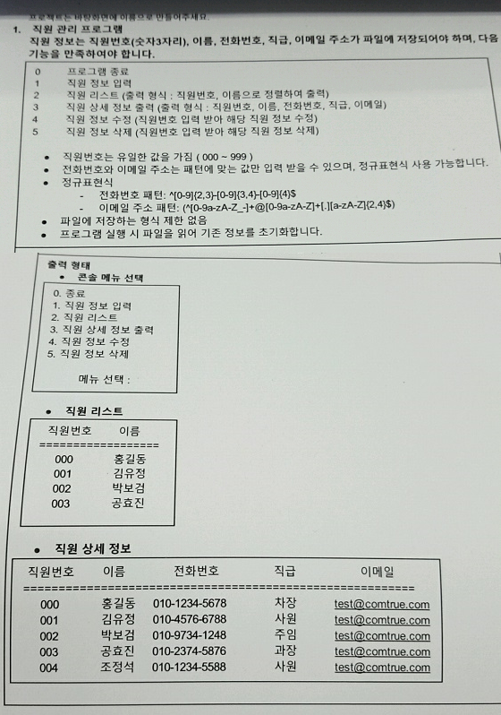

## 직원 관리 프로그램 과정 소개

### 요구사항 정의 

직원 정보는 직원번호(숫자3자리), 이름, 전화번호, 직급, 이메일 주소가 파일에 저장되어야 하며, 다음 기능을 만족해야 합니다.

> 0 프로그램 종료
>
> 1 직원 정보 입력
>
> 2 직원 리스트(출력 형식 : 직원번호, 이름으로 정렬하여 출력)
> 
> 3 직원 상세 정보 출력(출력 형식 : 직원번호, 이름, 전화번호, 직급, 이메일)
>
> 4 직원 정보 수정(직원번호 입력 받아 해당 직원 정보 수정)
>
> 5 직원 정보 삭제(직원번호 입력 받아 해당 직원 정보 삭제)

- 직원 정보는 유일한 값을 가짐(000~999)
- 전화번호와 이메일 주소는 패턴에 맞는 값만 입력받을 수 있으며, 정규표현식 사용 가능.
- 정규 표현식
  - 전화번호 패턴 : ^[0-9]{2,3}-[0-9]{3,4}-[0-9]{4}$
  - 이메일 주소 패턴 : (^[0-9a-zA-Z_-]+@[0-9a-zA-Z]+[.][a-zA-Z]{2,4}$)
  
- 파일에 저장하는 형식 제한 없음
- 프로그램 실행 시 파일을 읽어 기존 정보를 초기화합니다.

### 권장사항

각 스텝 별로 브랜치를 나누어 개발하는 것을 권장한다. 하나에 브랜치에 모두해도 상관은 없다.

### 코드리뷰

이 저장소를 자신의 개인 깃허브로 fork받은 후, IDE에서 clone하고 요구사항을 구현한다. 각 스텝 별 구현이 완료될 때마다 자신의 Remote 저장소에 push 후 슬랙 채널에 공유한다.